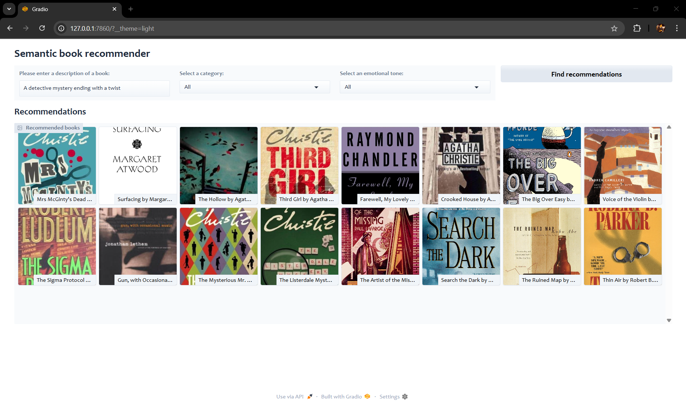

# Semantic Book Recommender 🚀  
LLM-powered, **containerized**, emotion-aware book discovery built with **LangChain, Chroma, Hugging Face Transformers** and a slick **Gradio** front-end via Docker.

[](https://huggingface.co/spaces/Hamza9320/semantic-book-recommender)


---

## Table of contents
1. [Project motivation](#project-motivation)
2. [UI preview](#ui-preview)
3. [Short demo](#short-demo)  
4. [Data](#data)  
5. [Pipeline overview](#pipeline-overview)  
6. [Quick start](#quick-start)  
7. [Code & notebook guide](#code--notebook-guide)  
8. [Using the Gradio app](#using-the-gradio-app)  
9. [Directory layout](#directory-layout)  
10. [License](#license)  

---

## Project motivation
The goal is to **recommend books from free-text descriptions**, while letting readers filter by broad category (fiction, nonfiction, children’s …) *and* mood (joy, suspense, sadness, etc.).  
Under the hood we combine semantic search with lightweight sentiment inference to return covers, titles and punchy blurbs in a scrollable gallery.

---

### UI preview

<p align="center">
  
</p>

---

### Short demo

<video src="docs/media/Demo.mp4" controls width="100%"></video>

---

## Data
* **Source** Kaggle public dump of Google Books API (~ 6.8 k rows).  
  *Original books.csv lives in `data/`*  
* **Cleaning & filtering**
  * Remove rows missing `description`, `num_pages`, `average_rating`, `published_year`.
  * Keep books whose description ≥ 25 words.
  * Add `title_and_subtitle`, fix missing thumbnails, append `&fife=w800` to up-rez images.
* **Engineered metadata**
  * **simple_categories** map noisy 500 + Google genres into 4 high-level buckets using rule-based mapping + BART-MNLI zero-shot back-fill (≈ 78 % accuracy on held-out sample).
  * **Emotions** (`anger`, `fear`, `joy`, `sadness`, `surprise`, `neutral`, `disgust`) scored per book with **distil-RoBERTa emotion classifier**; the dashboard lets users rank by the dominant tone.

---

## Pipeline overview

| stage | package | what happens |
|-------|---------|--------------|
| **Embedding** | `langchain_openai` | OpenAI ADA embeddings for each *tagged* description (`isbn13 + description`) |
| **Vector DB** | `Chroma` | In-memory store; cosine similarity search driven by LangChain retriever |
| **Sentiment** | `transformers` | `j-hartmann/emotion-english-distilroberta-base` – max emotion score across sentences |
| **Category back-fill** | `facebook/bart-large-mnli` | Zero-shot between *Fiction* vs *Non-fiction* |
| **Frontend** | `gradio` | Glass theme; textbox + 2 dropdowns → gallery of 16 covers (+ captions) |

---

## Quick start
```bash
# clone repo
git clone https://github.com/hamzahassan9320/llm-semantic-book-recommender.git
cd llm-semantic-book-recommender

# (optional) create env
conda create -n bookrec python=3.11
conda activate bookrec

# install deps
pip install -r requirements.txt

# add data locally (≈ 30 MB)
mkdir -p data notebook
cp /path/to/books.csv data/
cp /path/to/books_cleaned.csv notebook/
cp /path/to/tagged_description.txt notebook/

# launch dashboard
python src/gradio-dashboard.py
```

> Tested with **Python 3.11** on CUDA 12.4  
> (GPU strongly recommended for the one-off sentiment-scoring notebook).

---

## Docker

You can either **pull** the prebuilt image from Docker Hub or **build** it yourself.

### Option A: Pull & run

```bash
# Pull the image
docker pull hamza9320/gradio-app:latest

# Run (map host 7860 → container 7860)
docker run -d \
  -p 7860:7860 \
  --name gradio-app \
  -e OPENAI_API_KEY="$OPENAI_API_KEY" \
  hamza9320/gradio-app:latest

# Then browse to:
#   http://localhost:7860
```

### Option B: Build from source

```bash
# From the repo root (where your Dockerfile lives)
docker build -t hamza9320/gradio-app:latest .

# Then the same run command
docker run -d \
  -p 7860:7860 \
  --name gradio-app \
  -e OPENAI_API_KEY="$OPENAI_API_KEY" \
  hamza9320/gradio-app:latest

# Browse to http://localhost:7860
```

---

## Code & notebook guide

| File / notebook | Purpose |
|-----------------|---------|
| `notebook/data_exploration.ipynb` | EDA, cleaning, feature engineering, zero-shot labelling & emotion scoring |
| `src/gradio-dashboard.py`        | End-to-end pipeline (load → embed → search → serve) |
| `requirements.txt`               | Pinned runtime dependencies |
| `LICENSE`                        | MIT license text |

---

## Using the Gradio app

1. **Describe** the book you’re craving – *“coming-of-age on a distant planet with a hopeful vibe”*.
2. **Optionally** pick a **category** (Fiction, Non-fiction, Children’s …) or **tone** (Happy, Sad, Suspenseful …).
3. Click **Find recommendations**.  
   The top-16 matches (semantic + filters + emotion-ranking) appear as large covers with bite-sized blurbs. Click a cover to zoom.

👉 **Live demo** on Hugging Face Spaces: <https://huggingface.co/spaces/Hamza9320/semantic-book-recommender>

---

## Directory layout

    .
    ├── README.md             
    ├── LICENSE
    ├── requirements.txt
    ├── data/                  
    |   ├── books.csv
    ├── notebook/
    │   ├── data_exploration.ipynb
    │   ├── books_cleaned.csv
    │   └── tagged_description.txt
    └── src/
        └── gradio-dashboard.py

---

## License

Released under the **MIT License** 
